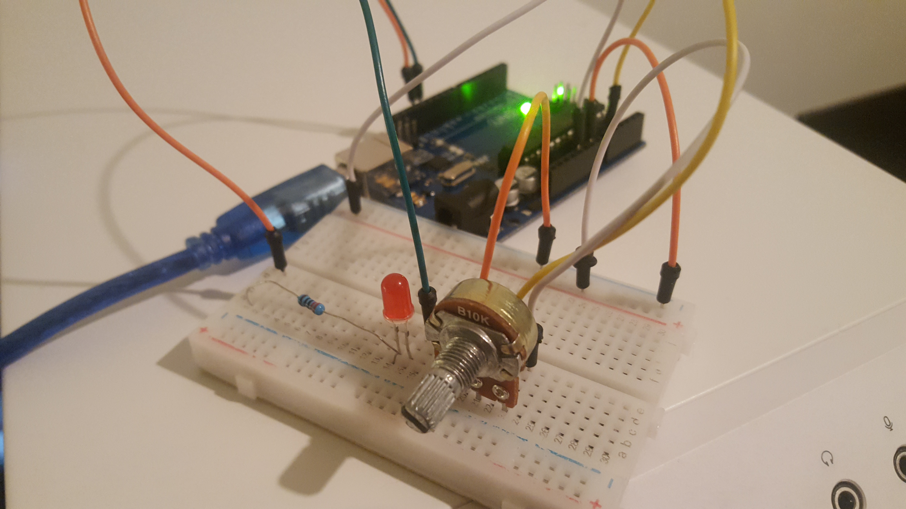
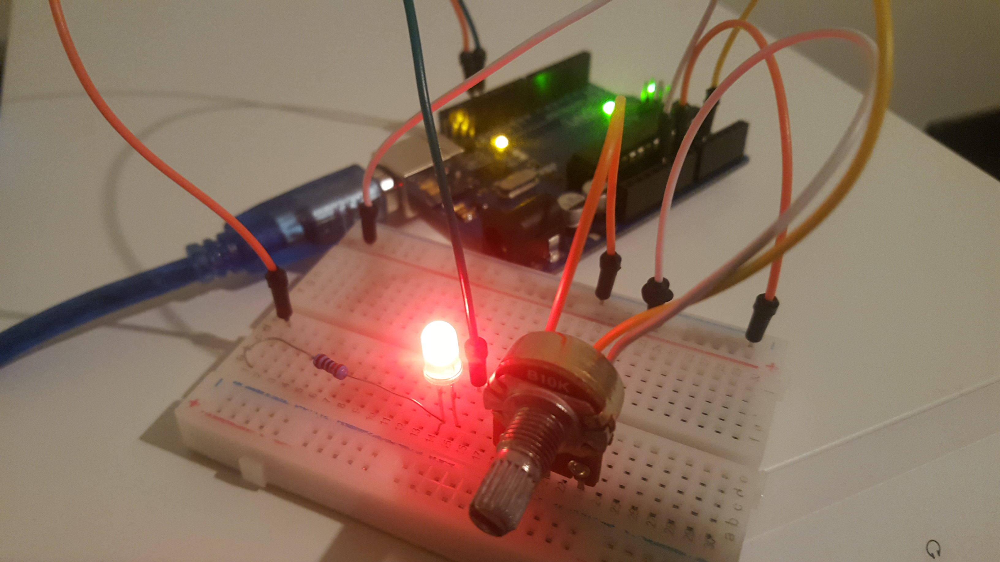
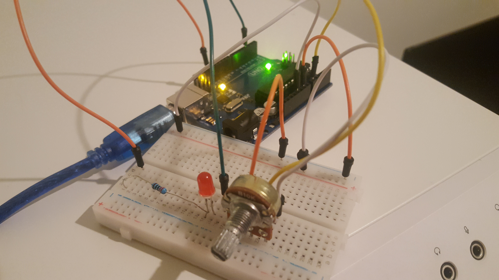

# Exercice 1

Dans cet exercice on cherche à contrôler la luminosité d'une LED par l'intermédiaire d'une résistance variable (avec un Arduino UNO). On va donc tester 2 méthodes :

 - Sans microcontrôleur
 - Avec un microcontrôleur

## Sans microcontrôleur

Les branchements sont assez simples, on a eu besoin de quelques câbles, d'une résistance, d'un potentiomètre et d'une LED.

    int LED = 13;
    
    void setup()
    {
      pinMode(LED, OUTPUT);
    }
    
    void loop()
    {
      int reading = analogRead(A0);
      reading = map(reading, 0, 1023, 0, 255); // Mapping reading to get values between 0 and 255
      analogWrite(LED, reading);
    }
Le code est également assez sommaire, on déclare une variable LED initialisée à 13 (car c'est sur le port 13 de la carte Arduino qu'elle est branchée). La fonction pinMode va assigner le port de la LED en sortie.
On utilise analogRead(A0) pour lire la valeur du potentiomètre *(branché au port A0)*, afin de l'assigner à la LED.

Cela nous donne les résultats suivants : 

> Résistance élevée

> Résistance moyenne

> Résistance faible

## Avec un microcontrôleur

Les branchements sont très similaires à la partie précédente.

    int LED = 3;
    
    void setup()
    {
      pinMode(LED, OUTPUT);
    }
    
    void loop()
    {
      int PWM = analogRead(A0);
      PWM = map(PWM, 0, 1023, 0, 255); // Mapping reading to get values between 0 and 255
      analogWrite(LED, PWM);
    }

La LED est cette fois-ci branchée au port 3 afin de récupérer un signal PWM en sortie. On récupère cette valeur avec la fonction analogRead, et on l'assigne à la LED.

Cela nous donne les résultats suivants : 
 
> Résistance élevée

> Résistance moyenne

> Résistance faible

## Conclusion
On peut clairement remarquer que l'utilisation du microcontrôleur est bien plus efficace. En effet, sans ce dernier, on ne peut pas régler de manière précise la luminosité de la LED : elle est soit allumée à pleine puissance, soit éteinte. Avec le microcontrôleur, on a un contrôle bien plus précis sur son intensité lumineuse.
