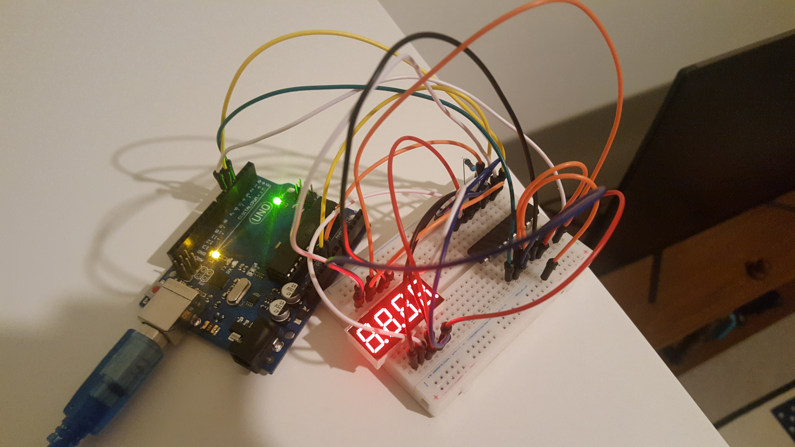

# Exercice 2
Dans cet exercice on cherche à contrôler un afficheur 4x7 segments, dans un premier temps sans utiliser un MAX7219, et dans un second temps avec.

## Sans MAX7219 (LESSON 15)
Les branchements sont un peu plus compliqués que dans l'exercice précédent, dans le sens où il y a beaucoup plus de branchements, et de résistances à inclure. De plus, il nous a fallu adapter le modèle présenté dans le tutoriel, car notre afficheur 4x7 segments comporte 12 pins, et non 16.

    #include <time.h>
    
    // Different segments
    const unsigned int A = 9; 
    const unsigned int B = 13;
    const unsigned int C = 4; 
    const unsigned int D = 6; 
    const unsigned int E = 7; 
    const unsigned int F = 10; 
    const unsigned int G = 3; 
    const unsigned int DP = 5; 
     
    const unsigned int Anode1 = 8;
    const unsigned int Anode2 = 11;
    const unsigned int Anode3 = 12;
    const unsigned int Anode4 = 2;
     
    // digit is the digit to display. Note that 4 is the furthest right and 1 is the furthest left
    unsigned int digit = 1;
    // incoming byte value
    char buffer[4];
    String value = "0";
    char a;
    unsigned int decimal = 0;
    unsigned int length = 1;
    
    void setup() {
      
      Serial.begin(9600);
      Serial.print(value);
      
    // Pin Setup
      pinMode(Anode1, OUTPUT);
      pinMode(Anode2, OUTPUT);
      pinMode(Anode3, OUTPUT);
      pinMode(Anode4, OUTPUT);
      
      
      pinMode(A,OUTPUT);
      pinMode(B,OUTPUT);
      pinMode(C,OUTPUT);
      pinMode(D,OUTPUT);
      pinMode(E,OUTPUT);
      pinMode(F,OUTPUT);
      pinMode(G,OUTPUT);
      pinMode(DP,OUTPUT);
      
      
    }
    
    void decodeAndWrite(unsigned int value){
     // Write values all high to turn off the previous number
       
      digitalWrite(A,HIGH);
      digitalWrite(B,HIGH);
      digitalWrite(C,HIGH);
      digitalWrite(D,HIGH);
      digitalWrite(E,HIGH);
      digitalWrite(F,HIGH);
      digitalWrite(G,HIGH);
      digitalWrite(DP,HIGH);
      
      switch(value){
        //  cases for each digit
         
        case 0:
         
        digitalWrite(A,LOW);
        digitalWrite(F,LOW);
        digitalWrite(E,LOW);
        digitalWrite(D,LOW);
        digitalWrite(C,LOW);
        digitalWrite(B,LOW);  
        break;
         
        case 1:
        
        digitalWrite(C,LOW);
        digitalWrite(B,LOW);
        break;
         
        case 2:
         
        digitalWrite(A,LOW);
        digitalWrite(G,LOW);
        digitalWrite(E,LOW);
        digitalWrite(D,LOW);
        digitalWrite(B,LOW);
        break;
         
        case 3:
         
        digitalWrite(C,LOW);
        digitalWrite(B,LOW);
        digitalWrite(A,LOW);
        digitalWrite(G,LOW);
        digitalWrite(D,LOW);
        break;
         
        case 4:
         
        digitalWrite(F,LOW);
        digitalWrite(B,LOW);
        digitalWrite(G,LOW);
        digitalWrite(C,LOW);
        break;
         
        case 5:
         
        digitalWrite(A,LOW);
        digitalWrite(F,LOW);
        digitalWrite(G,LOW);
        digitalWrite(C,LOW);
        digitalWrite(D,LOW);
        break;
         
        case 6:
         
        digitalWrite(C,LOW);
        digitalWrite(G,LOW);
        digitalWrite(E,LOW);
        digitalWrite(D,LOW);
        digitalWrite(F,LOW);  
        break;
         
        case 7:
         
        digitalWrite(A,LOW);
        digitalWrite(B,LOW);
        digitalWrite(C,LOW);
        break;
         
        case 8:
         
        digitalWrite(A,LOW);
        digitalWrite(F,LOW);
        digitalWrite(B,LOW);
        digitalWrite(G,LOW);
        digitalWrite(C,LOW);
        digitalWrite(D,LOW);
        digitalWrite(E,LOW);  
        break;
         
        case 9:
         
        digitalWrite(A,LOW);
        digitalWrite(F,LOW);
        digitalWrite(B,LOW);
        digitalWrite(G,LOW);
        digitalWrite(C,LOW);
        break;
         
        default:
        // if unknown value, display nothing
        break;
         
      }
    }
    
    void loop() {
      time_t t = time(NULL);
      struct tm tm = *localtime(&t);
    
      sprintf(buffer, "%02d%02d", tm.tm_mday, tm.tm_mon + 1);
      for (int i=0; i<4; i++) {
        digit=4-i;
        switch(digit){
       
          case 1:
           
          digitalWrite(Anode1,HIGH);
          digitalWrite(Anode2,LOW);
          digitalWrite(Anode3,LOW);
          digitalWrite(Anode4,LOW);
          decodeAndWrite(buffer[0] - '0');
          break;
           
          case 2:
           
          digitalWrite(Anode1,LOW);
          digitalWrite(Anode2,HIGH);
          digitalWrite(Anode3,LOW);
          digitalWrite(Anode4,LOW);
          decodeAndWrite(buffer[1] - '0');
          break;
           
          case 3:
           
          digitalWrite(Anode1,LOW);
          digitalWrite(Anode2,LOW);
          digitalWrite(Anode3,HIGH);
          digitalWrite(Anode4,LOW);
          decodeAndWrite(buffer[2] - '0');
          break;
             
          case 4:
           
          digitalWrite(Anode1,LOW);
          digitalWrite(Anode2,LOW);
          digitalWrite(Anode3,LOW);
          digitalWrite(Anode4,HIGH);
          decodeAndWrite(buffer[3] - '0');
          break;
           
          default:
          //too many digits given!
          digitalWrite(Anode1,LOW);
          digitalWrite(Anode2,LOW);
          digitalWrite(Anode3,LOW);
          digitalWrite(Anode4,LOW);
          break;
           
           
          }
          delay(1);
      }
    }
Étant donné qu'on souhaite afficher la date (Jour.Mois), on a besoin d'un buffer à 4 charactères. Dans ce dernier, on va pouvoir stocker la date au format JJMM *(on utilise pour cela la bibliothèque time.h)*.

Dans la fonction setup, on assigne chaque PIN de notre afficheur à la sortie (on s'est servi du schéma présent dans le tutoriel).
La fonction decodeAndWrite permet d'afficher une valeur sur l'un des segments de l'afficheur numérique.
Dans la fonction loop, on récupère la date et on affiche chaque chiffre sur les différents panneaux.

Cela nous donne le résultat suivant : 

*la date du jour était le 01 février, sur la photo on a l'impression qu'il est écrit 0182 mais en vrai on lisait bien 0102*

## Avec un MAX7219
Les branchements étaient un peu plus compliqués car il y a beaucoup de fils et il faut faire attention à ne pas se perdre.

    #include "LedControl.h"
    LedControl lc = LedControl(4,5,6,1);
    
    int count = 1000;
    
    void setup()
    {
        lc.shutdown(0,false);
        lc.setIntensity(0,5);
        lc.clearDisplay(0);
    }
    
    void loop()
    {
        String t = String(count++);
        lc.setDigit(0,0,(int)(t[0]-'0'),true);
        lc.setDigit(0,1,(int)(t[1]-'0'),false);
        lc.setDigit(0,2,(int)(t[2]-'0'),false);
        lc.setDigit(0,3,(int)(t[3]-'0'),false);
        delay(100);
        lc.shutdown(0,true);
        lc.shutdown(0,false);
    }
Le code est en revanche bien plus court, mais nous n'avons pas réussi à afficher des valeurs (toutes les lumières de l'afficheur 4x7 segments restaient constamment allumées). 

