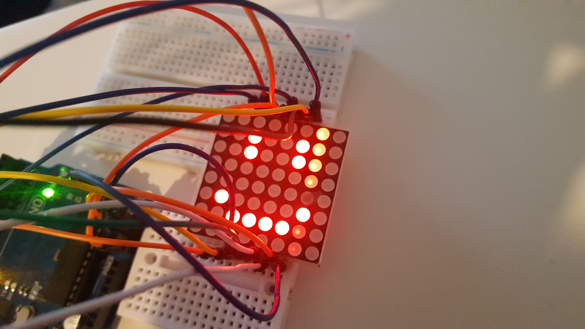

# Exercice 3
Dans cet exercice on cherche à contrôler une matrice 8x8 pour afficher du texte et des formes.

## Montage
Le montage était relativement simple. Cependant notre matrice 8x8 est légèrement défectueuse car une des LED ne fonctionne pas et une ligne reste légèrement allumée quoi qu'il arrive.

On a repris un code présent sur internet que l'on a modifié pour afficher ce qu'on voulait :

    //update from SAnwandter
    
    #define ROW_1 2
    #define ROW_2 3
    #define ROW_3 4
    #define ROW_4 5
    #define ROW_5 6
    #define ROW_6 7
    #define ROW_7 8
    #define ROW_8 9
    
    #define COL_1 10
    #define COL_2 11
    #define COL_3 12
    #define COL_4 13
    #define COL_5 A0
    #define COL_6 A1
    #define COL_7 A2
    #define COL_8 A3
    
    const byte rows[] = {
        ROW_1, ROW_2, ROW_3, ROW_4, ROW_5, ROW_6, ROW_7, ROW_8
    };
    const byte col[] = {
      COL_1,COL_2, COL_3, COL_4, COL_5, COL_6, COL_7, COL_8
    };
    
    // The display buffer
    // It's prefilled with a smiling face (1 = OFF, 0 = ON)
    byte A[] = {B11111111,B11000011,B10011001,B10011001,B10000001,B10011001,B10011001,B10011001};
    byte B[] = {B10000111,B10110111,B10110111,B10001111,B10110111,B10111011,B10111011,B10000011};
    byte C[] = {B11111111,B11100001,B11011111,B10111111,B10111111,B10111111,B11011111,B11100001};
    byte D[] = {B11111111,B11000111,B11011011,B11011101,B11011101,B11011011,B11000111,B11111111};
    byte E[] = {B11111111,B11000011,B11011111,B11000111,B11011111,B11011111,B11000011,B11111111};
    byte F[] = {B11111111,B11000011,B11011111,B11000111,B11011111,B11011111,B11011111,B11111111};
    byte G[] = {B11111111,B11000001,B11011111,B11011111,B11010001,B11011101,B11000001,B11111111};
    byte H[] = {B11111111,B11011011,B11011011,B11000011,B11011011,B11011011,B11011011,B11111111};
    byte I[] = {B11111111,B11000111,B11101111,B11101111,B11101111,B11101111,B11000111,B11111111};
    byte J[] = {B11111111,B11100011,B11110111,B11110111,B11110111,B11010111,B11000111,B11111111};
    byte K[] = {B11111111,B11011011,B11010111,B11001111,B11010111,B11011011,B11011011,B11111111};
    byte L[] = {B11111111,B11011111,B11011111,B11011111,B11011111,B11011111,B11000011,B11111111};
    byte M[] = {B11111111,B11111111,B10111011,B01010101,B01101101,B01111101,B01111101,B11111111};
    byte N[] = {B11111111,B11011101,B11001101,B11010101,B11011001,B11011101,B11111111,B11111111};
    byte O[] = {B11111111,B11000011,B10111101,B10111101,B10111101,B10111101,B11000011,B11111111};
    byte P[] = {B11111111,B11000111,B11011011,B11011011,B11000111,B11011111,B11011111,B11111111};
    byte Q[] = {B11111111,B11000011,B10111101,B10111101,B10111101,B10111001,B11000001,B11111110};
    byte R[] = {B11111111,B11000111,B11011011,B11011011,B11000111,B11011011,B11011011,B11111111};
    byte S[] = {B11111111,B11000011,B11011111,B11000011,B11111011,B11111011,B11000011,B11111111};
    byte T[] = {B11111111,B10000011,B11101111,B11101111,B11101111,B11101111,B11101111,B11111111};
    byte U[] = {B11111111,B10111101,B10111101,B10111101,B10111101,B11011011,B11100111,B11111111};
    byte V[] = {B11111111,B11011101,B11011101,B11011101,B11101011,B11101011,B11110111,B11111111};
    byte W[] = {B11111111,B01111101,B01101101,B10101011,B10101011,B11010111,B11111111,B11111111};
    byte X[] = {B11111111,B10111101,B11011011,B11100111,B11100111,B11011011,B10111101,B11111111};
    byte Y[] = {B11111111,B10111011,B11010111,B11101111,B11101111,B11101111,B11101111,B11111111};
    byte Z[] = {B11111111,B11000011,B11111011,B11110111,B11101111,B11011111,B11000011,B11111111};
    byte emoji[] = {B11111111,B11011011,B11011011,B11111111,B11111111,B10111101,B11000011,B11111111};
    
    float timeCount = 0;
    
    void setup() 
    {
        // Open serial port
        Serial.begin(9600);
        
        // Set all used pins to OUTPUT
        // This is very important! If the pins are set to input
        // the display will be very dim.
        for (byte i = 2; i <= 13; i++)
            pinMode(i, OUTPUT);
        pinMode(A0, OUTPUT);
        pinMode(A1, OUTPUT);
        pinMode(A2, OUTPUT);
        pinMode(A3, OUTPUT);
    }
    
    void loop() {
      // This could be rewritten to not use a delay, which would make it appear brighter
    delay(5);
    timeCount += 1;
    
    if(timeCount <  200) 
    {
      drawScreen(K);
    } 
    else if (timeCount <  400) 
    {
      drawScreen(A);
    } 
    else if (timeCount <  600) 
    {
      drawScreen(R);
    } 
    else if (timeCount <  800) 
    {
      drawScreen(A);
    } 
    else if (timeCount <  1000) 
    {
      drawScreen(D);
    } 
    else if (timeCount <  1200) 
    {
      drawScreen(I);
    } 
    else if (timeCount <  1400) {
      drawScreen(K);
    } 
    else if (timeCount < 2000) {
      drawScreen(emoji);
    }
    else {
      // back to the start
      timeCount = 0;
    }
    }
     void  drawScreen(byte buffer2[])
     { 
       // Turn on each row in series
        for (byte i = 0; i < 8; i++)        // count next row
         {
            digitalWrite(rows[i], HIGH);    //initiate whole row
            for (byte a = 0; a < 8; a++)    // count next row
            {
              // if You set (~buffer2[i] >> a) then You will have positive
              digitalWrite(col[a], (buffer2[i] >> a) & 0x01); // initiate whole column
              
              delayMicroseconds(100);       // uncoment deley for diferent speed of display
              //delayMicroseconds(1000);
              //delay(10);
              //delay(100);
              
              digitalWrite(col[a], 1);      // reset whole column
            }
            digitalWrite(rows[i], LOW);     // reset whole row
            // otherwise last row will intersect with next row
        }
    }

Chaque byte permet d'afficher un caractère (0 = LED allumée, 1 = LED éteinte). C'était donc assez intuitif de rajouter l’émoji que nous souhaitions dessiner. Le code est relativement bien commenté et simple à comprendre. Toutes les 2 secondes on affiche un caractère différent avec la fonction drawScreen.

On a donc le résultat suivant (pour l'émoji) :

Et une vidéo de démonstration est également visible dans le dossier media **(ex3-matrice_8x8_demonstration.mp4)**.
On y affiche le nom de notre équipe ainsi qu'un émoji :)
